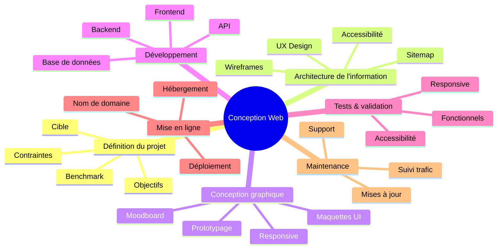

# Projet meirmind map-mind

```mermaid

mindmap
  root((Conception Web))
    Définition du projet
      Objectifs
      Cible
      Contraintes
      Benchmark
    Architecture de l'information   
      Sitemap
      Wireframes
      UX Design
      Accessibilité
    Conception graphique
      Moodboard
      Maquettes UI
      Responsive
      Prototypage
    Développement
      Frontend
      Backend
      Base de données
      API
    Tests & validation
      Fonctionnels
      Responsive
      Accessibilité
    Mise en ligne
      Hébergement
      Nom de domaine
      Déploiement
    Maintenance
      Suivi trafic
      Mises à jour
      Support
```
